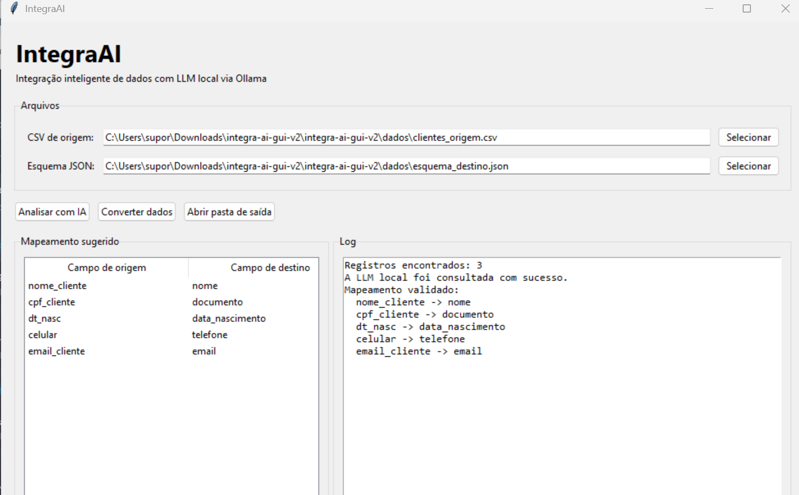

# 🤖 IntegraAI

Ferramenta de integração inteligente de dados utilizando uma **LLM local via Ollama**.

## 📌 Sobre o projeto

O IntegraAI é uma aplicação desenvolvida em Python para realizar integração e transformação inteligente de dados.

A aplicação utiliza uma LLM executada localmente através do Ollama para analisar os campos de um arquivo de origem e sugerir automaticamente o mapeamento para um esquema de destino.

## ✨ Funcionalidades

- Interface gráfica para utilização da ferramenta
- Leitura de arquivos CSV
- Leitura de esquema de destino em JSON
- Análise inteligente dos campos utilizando LLM
- Mapeamento automático entre origem e destino
- Possibilidade de alterar o mapeamento sugerido
- Conversão dos registros
- Geração de arquivos de saída
- Relatório da integração
- Processamento local através do Ollama

## 🧠 Inteligência Artificial

O projeto utiliza o **Ollama** para executar a LLM localmente.

Modelo utilizado:

`llama3.2:3b`

Dessa forma, a análise pode ser realizada localmente, sem necessidade de uma chave de API externa.

## 🖥️ Interface

O IntegraAI possui uma interface gráfica que permite:

1. Selecionar o arquivo CSV de origem
2. Selecionar o esquema JSON de destino
3. Clicar em **Analisar com IA**
4. Conferir o mapeamento sugerido
5. Alterar campos quando necessário
6. Clicar em **Converter dados**
7. Consultar o resultado e os arquivos gerados
## 🖥️ Captura da interface

Abaixo está a interface gráfica do IntegraAI em funcionamento:



## 📂 Estrutura do projeto

```text
IntegraAI/
├── dados/
├── output/
├── src/
│   ├── exporter.py
│   ├── extractor.py
│   ├── gui.py
│   ├── llm_mapper.py
│   ├── transformer.py
│   ├── validator.py
│   └── verificar_ollama.py
├── .env.example
├── .gitignore
├── README.md
└── requirements.txt---

## 🚀 Como executar

### 1. Pré-requisitos

Antes de executar o IntegraAI, tenha instalado:

- Python 3
- Ollama
- Git

O projeto utiliza uma LLM executada localmente através do Ollama, portanto não é necessária uma chave de API externa.

### 2. Baixar o projeto

Clone o repositório:

```powershell
git clone https://github.com/Stefanithe/IntegraAI.git
```

Entre na pasta:

```powershell
cd IntegraAI
```

### 3. Instalar as dependências

Execute:

```powershell
python -m pip install -r requirements.txt
```

### 4. Configurar o ambiente

Crie o arquivo `.env` utilizando o exemplo disponível no projeto:

```powershell
Copy-Item .env.example .env
```

### 5. Instalar o modelo no Ollama

O modelo utilizado por padrão é:

```text
llama3.2:3b
```

Caso ainda não esteja instalado:

```powershell
ollama pull llama3.2:3b
```

Para verificar os modelos disponíveis:

```powershell
ollama list
```

### 6. Executar o IntegraAI

Execute:

```powershell
python -m src.gui
```

A interface gráfica do IntegraAI será aberta.

---

## 🔄 Fluxo da aplicação

O funcionamento básico do sistema é:

```text
CSV de origem
      ↓
Leitura dos campos
      ↓
LLM local via Ollama
      ↓
Sugestão de mapeamento
      ↓
Validação do mapeamento
      ↓
Conversão dos registros
      ↓
JSON de saída + relatório
```

A LLM analisa os nomes dos campos do arquivo de origem e sugere sua correspondência com o esquema de destino.

Exemplo:

```text
nome_cliente   -> nome
cpf_cliente    -> documento
dt_nasc        -> data_nascimento
celular        -> telefone
email_cliente  -> email
```

O usuário pode revisar e alterar o mapeamento antes de realizar a conversão.

---

## 📁 Arquivos de saída

Após a conversão, os resultados são armazenados na pasta:

```text
output/
```

O sistema pode gerar arquivos contendo:

- dados convertidos;
- relatório da integração;
- quantidade de registros processados;
- quantidade de registros convertidos;
- quantidade de registros com erro.

---

## 🔐 Privacidade

O IntegraAI utiliza uma LLM executada localmente através do Ollama.

Isso permite que a análise dos campos seja realizada no próprio computador, sem depender de uma API externa para o processamento pela LLM.

Essa arquitetura é especialmente interessante para cenários de integração que envolvem dados internos ou sensíveis.

---

## 🛠️ Tecnologias utilizadas

- Python
- Tkinter
- Ollama
- Llama 3.2
- JSON
- CSV
- Git
- GitHub

---

## 📌 Status do projeto

🟢 **Funcional**

A versão atual permite:

- analisar campos utilizando uma LLM local;
- gerar automaticamente sugestões de mapeamento;
- revisar o mapeamento pela interface gráfica;
- converter registros;
- gerar arquivos de saída;
- gerar relatório da integração.

---

## 🔮 Melhorias futuras

Algumas possibilidades de evolução do projeto:

- suporte a Excel;
- suporte a bancos de dados;
- histórico de integrações;
- configuração de diferentes modelos LLM;
- validações avançadas de dados;
- exportação para diferentes formatos;
- melhoria da interface gráfica;
- empacotamento como aplicativo executável.

---

## 👩‍💻 Autor

Projeto **IntegraAI** desenvolvido como solução de integração inteligente de dados utilizando Inteligência Artificial local.

---

⭐ Se este projeto foi útil, considere deixar uma estrela no repositório.
